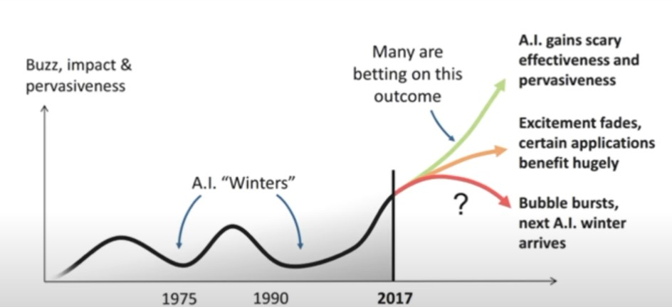
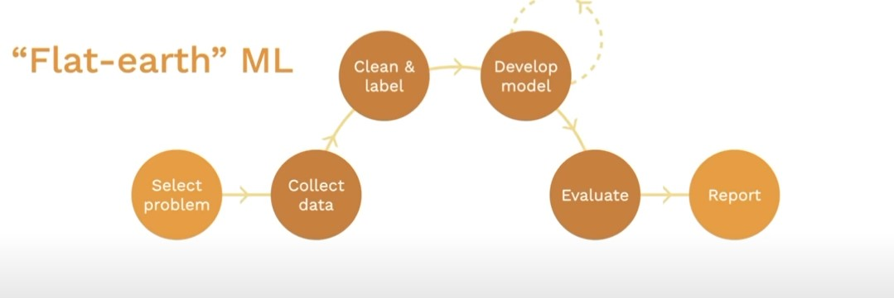
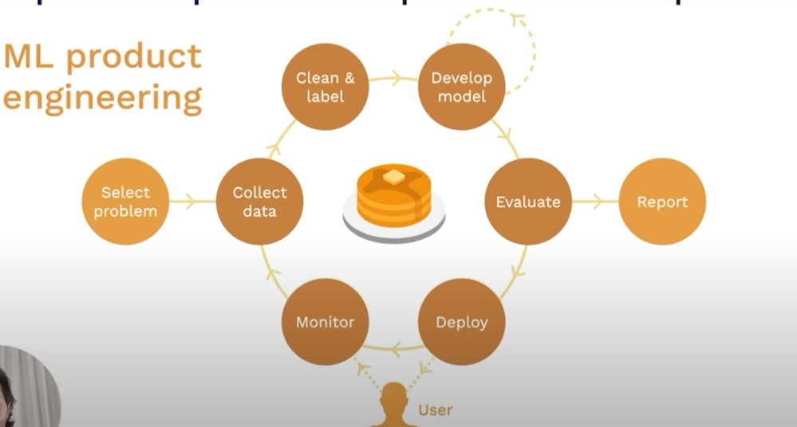
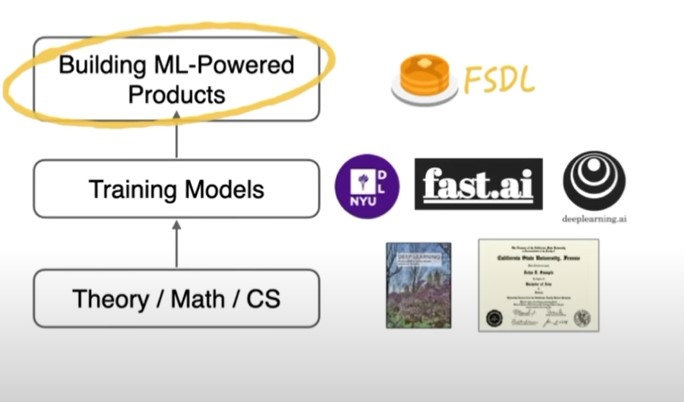
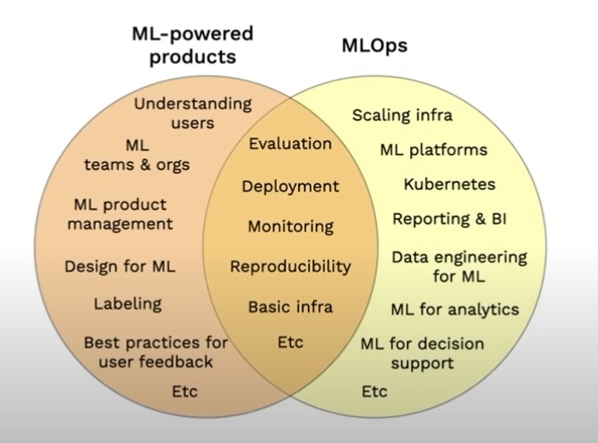
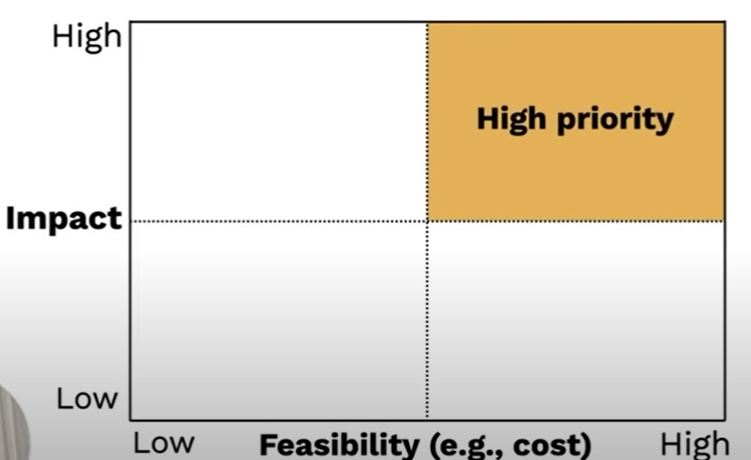

# Course Vision

Full stack Deep Learning '22 is a course and community for people building ML powered products.

ML in 2022:
- [Dall-E 2](https://openai.com/dall-e-2/) image generation model
- Tik-tok on the consumer side
- ML powered products are not confined now only to massive companies
- Descript 
- Email generation startups

Why is this happening on a large scale? It is because of the commoditization of model training. Initially working around the codebase of GPT-1 was very complicated whereas now, anyone can use `huggingfaces` to deploy a state-of-the-art NLP model in one or two lines of code. 

```python
from transformers import pipeline
classifier = pipeline('sentiment-analysis')
```
*Image*

Advent of AutoML, companies are providing model-as-a-service where it is not required to download libraries but one can direcly use a network call to use predictions from state-of-the-art model. On the open-source software side, a lot of frameworks are coming up that are standardizing things and most of the boiler plate code is being replaced (e.g. `Keras` and `PyTorch Lightning`).

History of AI has seen 2 winters, and there has been rise and fall of public perception of the technology where the tech didnot live up to it's expectations and people became skeptical about it. 



**Conjecture**
Avoid the next AI winter by transalating research progress to real world products with usecases and true value.



Building ML based products is totally different from ML systems that are built in academia. ML systems that are designed traditionally in academia can be termed as `Flat-earth ML`. This paradigm is famililar to many people. 

**Flat-Earth ML Flow**
1. You start by selecting a problem
2. Collect some data to use to solve the problem
3. Cleaning and Labelling the data
4. Iterate on developing your model until a model is obtained that performs well on the dataset collected
5. Evaluate that model
6. If the model performs well according to user-defined metrics, deliverables are in form of report, Jupyter Notebook, Paper, some slides (`Fin`)

**Problems with this approach**

If we deploy such a model into real world scenarios, there are huge chances that the models won't work for long. There is an outer loop in addition to what was discussed previously in `Flat-Earth ML`



1. Deploy the model into production after Evaluation
2. Measure how the model is performing when it interacts with real users 
3. Use the real world data to build a data flywheel
4. Continue this process over and over again



This course is all about how to do this process of building `ML-Powered-Products`. Basics of CS and Math behind DL won't be covered. Some practical aspects of training a model will also be covered, obviously there are many great courses available `fast.ai, NYU DL Course, DL.ai, Google for Developers ML Course`for this as well. This course covers the unique aspects that you need to know beyond just training models and making ML-Powered-Products.

## Goals of this course
- Build up generalist skills and an understanding of the components of a ML-powered-product (and ML projects more genrally)
- Teach enough MLOps to get things done
- Best practises and motivation behind them
- Learn somethings that might help you with ML Engineer Job interviews
- Form a community to learn together and from each other

## Not our goals 
- Teach you ML or SWE from scratch
- Cover the whole breadth of a DL course
- Make you expert in any single aspect of ML
- Do research in DL
- Cover the full spectrum of MLOps

## Prerequisites
- Machine Learning
1. [Andrew NG](https://www.coursera.org/collections/machine-learning)
2. [Google ML Crash Course](https://developers.google.com/machine-learning/crash-course)
- Software Engineering
    - [The Missing Semester](https://missing.csail.mit.edu/)


## ML-powered products vs MLOps


MLOps is a discipline which has emerged in the last couple of years, that is about practises for deploying, maintaining and operating ML models and systems that generate these ML models in production. A lot of MLOps is all about, how we put together the infrastructure that will allow us to build models in a repeatable and governable way, how we are able to collaborate on these systems as a team and how we are able to run these ML systems in a potentially high scale production setting. 

ML-Powered-Products on the other hand is distinct but has some overlapping with MLOps. To make a great ML-powered-product, the focus is less on the infrastructure side of MLOps but more on how to fit machine learning into the context of product or the application that we are building. Things like:
- How users are interacting with your model?
- What type of model do you need?
- How do you build a team or an organization that can work together effectively on ML systems?
- How do you do product management in context of ML?
- What are the best practises for designing products that use ML? Like data labelling, capturing feedback from users etc...

## Course Logistics
- Discord
- Course Project
- Labs (Creating an application that allows us to take a picture of handwritten page of text and then transcribe that into actual text)

**Summary**
- ML Powered Products are going mainstream thanks to the democratization of modelling
- Building great products require a different approach than building great models (different tools, mindsets and approach)

# When to use ML

## When to use ML at all

### Lots of ML Projects fail
The probability of a ML Project failing is very high as compared to software products in general. Almost 87% of data science projects fail according to blogs and sources (Is this statistic valid, because 73% of statistics is made up on the spot).

A more valid statistic is 25%. 

### Why?
Why does ML projects fail?
1. ML is still research -- shouldnot aim for 100% 
2. Many projects are doomed to fail even before they are undertaken because:
- Technically infeasible or poorly scoped (takes a long time to see value in models that are developed)
- Never make the leap to production (A team that is responsible for developing a model may not be the right team to deploy the model into production and there is a friction because the model might look promising in Jupyter Notebooks)
- Unclear success criteria (In a broader organization, everyone is not on the same page about what we would consider as to be successful)
- Works but doesnot solve a big enough problem to be worth the complexity (Most frustrating. The model works well and solves the problem that was set to solve but it is not scalable, and organization decides that this is not worth the additional complexity that it is going to take)

**Important**
The bar for the ML Project that the value of project must outweigh not just the cost of developing it but the additional complexity that the ML systems introduce in the software)  

### ML introduces a lot of complexity
- Erodes the boundaries between systems (the predictions that a ML system makes influence other systems that they interact with; if you recommend a user with a content that changes their behavior and it makes it hard to make ML as a component)
- Relies on expensive data dependencies (If the ML system relies on a feature that is generated by another part of the system then those types of dependencies can be very expensive to maintain)
- Commonly plagued by system design anti-patterns
- Subject to the instability of the external world

Machine Learning as a technology tends to introduce a much higher rate of interest than other software. **Recommended Read:** [*Machine Learning: The High-Interest Credit Card of Technical Debt*](https://research.google/pubs/pub43146/)

### Before starting an ML Project

Ask youself these questions, before you are starting a ML Project:
1. Are we ready to use ML?
    - Do we have a product, maybe something to collect data and monitor whether it is working?
    - Are we collecting data and storing it in a sane way?
    - Do we have the right people? 
2. Do we really need ML to solve this problem?
    - Do we need to solve this problem at all? Or we just need a reason to use ML because we are excited about the technology?
    - Have we tried using rules or simple stats? Usually in many usecases rule based systems are much efficient than 80% of ML usecases (NLP and CV are exceptions)
3. Is it ethical? 

## How to pick problems to solve with ML?

### TL/DR: High Impact, Low Cost

1. High impact problems are likely to be those that address
    - Friction in your product
    - Complex parts of your pipeline
    - Places where cheap prediction is valuable
    - What other people in your industry are doing
2. Low cost projects are those with data available and where bad predictions are not too harmful



### Mental models for high-impact ML Projects

- `Mental Model 1` Where can you take advantage of cheap prediction?
- `Mental Model 2` Where is the friction in your product?
- `Mental Model 3` Where can you automate complicated manual process?
- `Mental Model 4` What are other people doing?

<details>
<summary><code>Model 1: What does ML make economically feasible?</code></summary>
A book named <i>The Economics of AI</i> asks the question that what problems does the ML make economically feasible to solve that were not feasible to solve in the past?

- AI reduces the cost of production (previously this was manual, so the person might take a long time to get predictions. Now this is automated and can be done using AI in a fraction of second.)
- Prediction is central for decision making
- Cheap prediction means 
    - Prediction will be everywhere
    - Even in problems where it was too expensive before (e.g. for most people, hiring a driver)
- Implication: Look for projects where cheap prediction will have a huge business impact

To summarize:

**Choose a problem/project where cheap prediction will have a huge business impact**

</details>
<details>
<summary><code>Model 2: Where is the friction in your product?</code></summary>
According to the blog post, <i><b>Three Principles for Designing ML Powered Products</b></i> by Spotify, talks about the principles that they used to develop the discover weekly feature that is one of the most powerful features in Spotify. 
<q><i>Discover Weekly removed the friction of chasing everything down yourself and instead brought the music to you in a neat little package every morning.</i></q>
</details>

<details>
<summary><code>Mental Model 3: What is ML good at?</code></summary>
A must read blog by Andrej Karpathy on <i><b>Software 2.0</b></i>, states that ML is really useful if we can take a really complex part of our software system which is a messy stack of handwritten rules and replace that with Machine Learning (gradient descent). This scenario is a potentially good candidate for automating with ML.
</details>

<details>
<summary><code>Mental Model 4: What are other people doing?</code></summary>
Worth looking that what other industries are doing with ML. The article by Netflix titled <i><b>Human-Centric Machine Learning Infrastructure @Netflix</b></i> covers a spectrum of usecases of ML at Netflix. 
- Papers from Google, Facebook, Nvidia, Netflix etc.
- Blog posts from top earlier-stage companies (Uber, Lyft, Spotify, Stripe etc.)
</details>

### Mental models for assessing the cost feasibility of ML projects

We will now discuss the mental models that are used to assess the cost of an ML project. There are 3 main drivers for this:

1. Data availability (how easy for you is it to get the data that you need to solve the problem)
2. Accuracy requirement (for the problem that we are solving)
3. Problem difficulty (intrinsic difficulty of problem to be solved)

<details>
<summary><code>Data availability</code></summary>

- How hard is it to acquire data?

    The key questions that we might use here to assess whether data availability is going to be a bottleneck for your project is do we have this data already, and if not how hard is it or expensive is it going to be to acquire.
- How expensive is data labelling?
    How expensive is it not just to acquire data but also to label it. If the labelers are really expensive then getting enough data to solve the problem really well might be difficult.
- How much data will we needed?
    This is difficult to assess apriori, but is an important input. It helps stabilize the data. 
- How stable is the data?
    If we work with data that is changing frequently with time, such projects will be less feasible, compared to projects that have data that is changing less. Especially true in ML application scenarios where data collection is expensive.
- Data security requirements?
    If you are able to collect data from the users and retrain your model on same data it is cost efficient. 
</details>

<details>
<summary><code>Accuracy Requirement</code></summary>

</details>


# Lifecycle


# Readings

## Blogs
1. Using Machine Learning to Predict Values of Homes On Airbnb
2. Using Machine Learning to improve Streaming Quality at Netflix
3. 150 Successful Machine Learning Models: 6 Lessons Learned at Booking.com 
4. How we grew 0 to 4 million women on our fashion app, with a vertical machine learning approach 
5. Machine Learning-Powered Search Ranking of Airbnb Experiences
6. From shallow to deep learning in fraud
7. Space, Time and Groceries 
8. Creating a modern OCR pipeline using Computer Vision and Deep Learning
9. Scaling Machine Learning at Uber with Michelangelo
10. Spotify's Discover Weekly: How machine learning finds you new music 

<b>A list compiled by Chip Huyen (Machine Learning Systems Design Lecture 2 Note)</b>